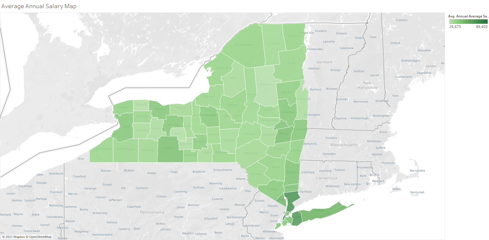

# NY data analysis
Tableau

NYS Annual Average Salary by Counties

The above chart shows the average salary in different counties of new york state. Dark green means higher average salaries whereas lighter color means lower salaries.

NYC crimes in parks

The above chart shows crimes reported in different parks in NYC.
